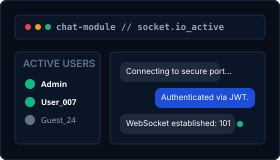
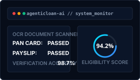
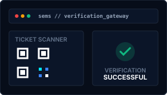
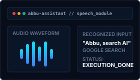

<!--
  WORLD-CLASS GITHUB PROFILE README
  Designed for: Abdul Kani B.
  Aesthetic: Premium Developer Portfolio (Futuristic, Minimal, Vercel-inspired)
  Theme: Blue, White, Black, Glassmorphism
-->

  <!-- Minimalist Visitor Counter Badge -->
  

 

<!-- Premium Animated Hero Banner Header -->

  

<!-- Subtle Pulse Divider -->

  

 

<!-- ================= ABOUT ME ================= -->
## 🚀 Profile Overview

I am an **AI Engineer & Full-Stack Developer** pursuing my **B.Tech in Information Technology** at **Sri Eshwar College Of Engineering** (2024 - 2028).

My work bridges algorithmic logic with robust scalable architectures, specializing in **Agentic AI orchestration**, deep learning workflows, and the MERN stack. I am passionate about engineering high-efficiency systems and translating complex user problems into fluid digital experiences.

  

### ⚡ Technical Profile Summary
* 🎓 **Education**: B.Tech IT @ Sri Eshwar College Of Engineering (Current CGPA: `8.07` till 3rd SEM)
* 🤖 **Core Passion**: Agentic AI, Computer Vision, and High-Performance client-server systems.
* 📍 **Location**: Tamil Nadu, India
* 📧 **Contact**: [abdulkani.b2024it@sece.ac.in](mailto:abdulkani.b2024it@sece.ac.in) | 📞 **+91 8072924468**

  <a href="https://dynamic-trifle-5a321e.netlify.app/"><strong>Explore Personal Portfolio Website →</strong></a>

 

  

 

<!-- ================= INTERNSHIPS ================= -->
## 💼 Professional Experience

### iGenuine Technologies
**MERN Stack Developer Intern** | `Dec 2025`

  

Developed production-level full-stack web applications using the MERN stack, crafting high-performance, responsive user interfaces and building highly secure RESTful APIs.

* **Real-Time Communications**: Implemented a responsive chat application with WebSocket integration for live, instant messaging.
* **Security & Authentication**: Engineered secure user authentication flows (JWT) and route guards.
* **Database Optimization**: Maintained backend databases and optimized MongoDB schemas for seamless data transactions.

**Stack**: `MongoDB` • `Express` • `React.js` • `Node.js` • `RESTful APIs` • `WebSockets` • `Socket.io`

 

  

 

<!-- ================= FEATURED PROJECTS ================= -->
## ⚡ Engineering Projects

### 01 / AgenticLoan AI
**AI-Powered Loan Approval System** | `Feb 2026`

  

An intelligent finance automation system designed to eliminate manual bottlenecks in the loan application and approval lifecycle.

* **Document Extraction (OCR)**: Automatically extracts and cross-validates candidate info from uploaded identity proofs.
* **Predictive Credit Rating**: Utilizes machine learning models to assess application risk and predict applicant eligibility.
* **Conversational Agent**: Integrates a GPT-based chatbot and voice assistant to collect data dynamically and submit applications.
* **Underwriter Console**: Built an admin dashboard for document inspection and application tracking.

**Stack**: `React` • `Node.js` • `MongoDB` • `Groq AI` • `OCR` • `Voice Assistant`
👉 [**Explore AgenticLoan AI Repo →**](https://github.com/abdulkani007/AgenticLoan-AI)

---

### 02 / SEMS
**Sports Event Management System** | `Sep 2025`

  

A secure, high-performance event management web system built to handle registrations and ticket access controls for large athletic events.

* **QR Gateway Check-in**: Generates secure QR ticket credentials allowing scan-based contactless event entry.
* **Access Control**: Role-based access hierarchies (Attendees, Organizers, Admins) for scheduling and security.
* **Real-time Tracking**: Provides organizers with live participant registries and scoreboards.

**Stack**: `React` • `Node.js` • `MongoDB` • `QR Verification` • `Auth`
👉 [**Explore SEMS Repo →**](https://github.com/abdulkani007/SEMS)

---

### 03 / Abbu Assistant
**AI Personal Voice Assistant** | `Mar 2025`

  

A localized AI assistant designed to execute system-level automation and command execution through vocal cues.

* **Voice Parsing**: High-accuracy speech recognition algorithms to process custom vocal inputs.
* **Service Integrations**: Connects to Google APIs for instant web scraping, note-logging, and media search actions.
* **System Automation**: Scripted command functions to open applications and perform system operations.

**Stack**: `Python` • `Speech Recognition` • `Google API` • `Automation`
👉 [**Explore Abbu Assistant Repo →**](https://github.com/abdulkani007/Abbu-Assistant)

 

  

 

<!-- ================= TECHNICAL SKILLS ================= -->
## 🛠️ Technical Competency Matrix

| Domain | Technologies &amp; Frameworks |
| :--- | :--- |
| **Programming** | `C` • `C++` • `Python` • `Java` • `JavaScript` |
| **Frameworks &amp; Web** | `React.js` • `HTML5` • `CSS3` • `Tailwind CSS` • `Node.js` • `Express.js` |
| **Databases** | `MongoDB` • `MySQL` • `Firebase` |
| **Core Science** | `Data Structures &amp; Algorithms (DSA)` • `Database Management (DBMS)` • `OOPS` |
| **Data Viz** | `Matplotlib` • `Power BI (Basics)` |
| **Developer Tools** | `VS Code` • `Git` • `GitHub` • `IntelliJ` • `Postman` • `Canva` • `Flutter` • `Shellscripting` |

 

  

 

<!-- ================= CERTIFICATIONS ================= -->
## 📜 Industry Certifications

  

* 🚀 **Salesforce** — Certified Agentforce Specialist (Dec 2025)
* ☕ **Oracle** — Java Oracle Batch (Nov 2025)
* 📊 **NPTEL** — Database Management System (Sep 2025)
* 🧠 **Great Learning** — Robotics and AI (Nov 2024)
* 🎓 **IIT Bombay** — C &amp; CPP Training (Nov 2024)
* 📐 **MathWorks** — MATLAB Onramp (Dec 2024)

 

  

 

<!-- ================= CODING STATS ================= -->
## 💻 Coding Milestones &amp; Profiles

  

* **LeetCode** — Solved 230+ Problems (Max Streak: 24 | Active Days: 100+ | Rank: 621,246)
* **Skillrack** — Solved 1120+ Programming Challenges
* **CodeChef** — Solved 300+ Problems (Global Rank: 41,635)
* **HackerRank** — Problem Solving (Basic Certified) | Java (5★) | C++ (2★) | SQL (2★)

  
  &nbsp;&nbsp;
  
  &nbsp;&nbsp;
  

 

  

 

<!-- ================= ACHIEVEMENTS ================= -->
## 🏆 Key Achievements

> [!NOTE]
> ### Competitive Hackathons
> * **Runner-up** — PSG Tech College (Ripple Room Competition, Srishti 2K25).
> * **2nd Prize** — KPR College of Engineering (Paper Presentation, Fiestaa ’26).
> * **Finalist** — Embadathon (Inter-college competition).
> * **Active Competitor** — Participated in multiple hackathons on devfolio, Unstop, Creatathon, and Freshathon.

 

  

 

<!-- ================= GITHUB STATS & METRICS ================= -->
## 📊 System Metrics &amp; GitHub Statistics

  
  &nbsp;
  

  

 

  <h3>🏆 GitHub Trophies</h3>
  

 

<!-- ================= SNAKE CONTRIBUTION GRAPH ================= -->

  <h3>🐍 Snake Contribution Timeline</h3>
  

 

  

 

<!-- ================= DEVELOPER QUOTE ================= -->

  <table width="80%" border="0" cellpadding="15" cellspacing="0" style="background-color: #070D19; border-left: 4px solid #00E5FF; border-radius: 4px;">
    <tr>
      <td>
        

          "The best way to predict the future is to design and program it. Driven by computational curiosity, executing with agentic precision."
        

      </td>
    </tr>
  </table>

 

  

 

<!-- ================= CONNECT WITH ME ================= -->
## 🌐 Connect &amp; Network

  
  &nbsp;&nbsp;
  
  &nbsp;&nbsp;
  
  &nbsp;&nbsp;
  

 
 

<!-- ================= FOOTER ================= -->

  

