<!--
  WORLD-CLASS GITHUB PROFILE README
  Designed for: Abdul Kani B.
  Aesthetic: Premium SOC Dashboard / Cyber-Green Terminal (ScamON Theme)
  Theme: Neon Cyber-Green, Amber, Dark Slate, Black
-->

  <!-- Minimalist Visitor Counter Badge -->
  

<!-- 01 / Premium Animated Hero Banner Header -->

  

<!-- 02 / Animated Terminal Console (Whoami / Skills / Projects Index) -->

  

  

  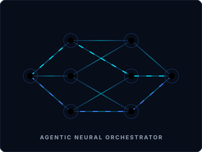

  

<!-- ================= ACTIVE DEPLOYMENTS ================= -->

  

  

<!-- ================= OPERATIONAL HISTORY ================= -->

  

  

<!-- ================= SKILLS MATRIX (ICON DASHBOARD) ================= -->

  

  

<!-- ================= ACHIEVEMENTS CONSOLE ================= -->

  

  

<!-- ================= CERTIFICATIONS ================= -->

  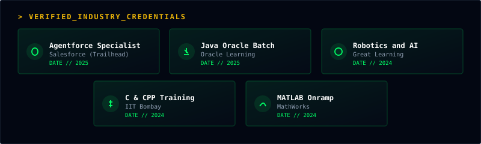

  

<!-- ================= CODING STATS ================= -->

  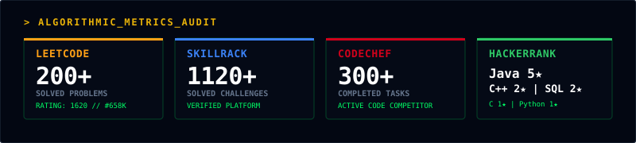

  
  &nbsp;&nbsp;
  
  &nbsp;&nbsp;
  

  

<!-- ================= CONNECT WITH ME ================= -->

  
  &nbsp;&nbsp;
  
  &nbsp;&nbsp;
  
  &nbsp;&nbsp;
  

 

<!-- ================= FOOTER ================= -->

  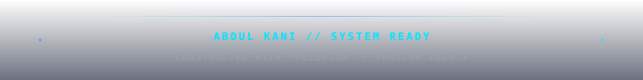

