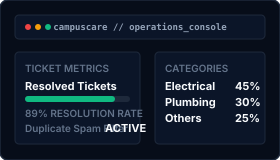
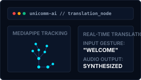

<<<<<<< HEAD
<!--
  WORLD-CLASS GITHUB PROFILE README
  Designed for: Abdul Kani
  Aesthetic: Premium Developer Portfolio (Futuristic, Minimal, Vercel-inspired)
  Theme: Blue, White, Black, Glassmorphism
-->

  <!-- Minimalist Visitor Counter Badge -->
  

 

<!-- Premium Animated Hero Banner Header -->

  

<!-- Subtle Pulse Divider -->

  

 

<!-- ================= ABOUT ME ================= -->
<table width="100%" border="0" cellpadding="12" cellspacing="0">
  <tr>
    <td width="55%" valign="top">
      <h2>🚀 Profile Overview</h2>
      
I am a passionate <strong>AI Engineer &amp; Full Stack Developer</strong> and an <strong>Information Technology</strong> student at <strong>Sri Eshwar College of Engineering</strong> based in Tamil Nadu, India.

      
My work centers around bridging advanced artificial intelligence models with modern, scalable web architectures. I specialize in designing and deploying <strong>Agentic AI</strong> workflows, building responsive client-server systems, and optimizing real-time data pipelines.

      
I am driven by clean code, architectural elegance, and the challenge of building intelligent products that solve real-world logistical and operational problems.

    </td>
    <td width="45%" valign="top" align="center">
      <table width="100%" border="0" cellpadding="8" cellspacing="0" style="background-color: #070D19; border: 1px solid #1E293B; border-radius: 8px;">
        <tr>
          <td>
            <h3 style="margin-top: 0;">⚡ Current Focus</h3>
            <ul>
              <li>🤖 <strong>Agentic AI</strong> architectures &amp; orchestration</li>
              <li>👁️ Custom <strong>Computer Vision</strong> pipelines</li>
              <li>☁️ Scalable, cloud-native backend systems</li>
              <li>🌐 Premium web interfaces &amp; interactions</li>
            </ul>
          </td>
        </tr>
      </table>
       
      <!-- Dynamic neural network vector graphic -->
      
    </td>
  </tr>
</table>

 

  

 

<!-- ================= EXPERIENCE ================= -->
<h2>💼 Experience</h2>

<table width="100%" border="0" cellpadding="12" cellspacing="0">
  <tr>
    <td width="20%" valign="top" align="center">
      <code style="font-size: 14px; color: #00E5FF;">2024 - Present</code>
       
      
    </td>
    <td width="80%" valign="top">
      <h3>MERN Stack Intern</h3>
      
Full Stack Application Development &amp; Systems Engineering

      <ul>
        <li>Designed and developed production-ready full-stack applications with high performance.</li>
        <li>Architected secure, reliable <strong>REST APIs</strong> and implemented robust authentication workflows.</li>
        <li>Built an interactive, real-time chat application utilizing WebSockets for instant message updates.</li>
        <li>Optimized database schemas and queries for seamless MongoDB integration, reducing query times.</li>
      </ul>
      

        <code style="background-color: #0B1329; color: #E2E8F0; padding: 2px 6px; border-radius: 4px;">React</code> &nbsp;
        <code style="background-color: #0B1329; color: #E2E8F0; padding: 2px 6px; border-radius: 4px;">Node.js</code> &nbsp;
        <code style="background-color: #0B1329; color: #E2E8F0; padding: 2px 6px; border-radius: 4px;">Express</code> &nbsp;
        <code style="background-color: #0B1329; color: #E2E8F0; padding: 2px 6px; border-radius: 4px;">MongoDB</code> &nbsp;
        <code style="background-color: #0B1329; color: #E2E8F0; padding: 2px 6px; border-radius: 4px;">REST APIs</code> &nbsp;
        <code style="background-color: #0B1329; color: #E2E8F0; padding: 2px 6px; border-radius: 4px;">WebSockets</code>
      

    </td>
  </tr>
</table>

 

  

 

<!-- ================= TECH STACK ================= -->
<h2>🛠️ Technologies &amp; Tools</h2>

<table width="100%" border="0" cellpadding="8" cellspacing="0">
  <tr>
    <td width="20%"><strong>Languages</strong></td>
    <td width="80%">
      
      
      
      
      
    </td>
  </tr>
  <tr>
    <td width="20%"><strong>Frontend</strong></td>
    <td width="80%">
      
      
      
      
    </td>
  </tr>
  <tr>
    <td width="20%"><strong>Backend &amp; DB</strong></td>
    <td width="80%">
      
      
      
      
      
    </td>
  </tr>
  <tr>
    <td width="20%"><strong>AI &amp; Computer Vision</strong></td>
    <td width="80%">
      
      
      
      
      
    </td>
  </tr>
  <tr>
    <td width="20%"><strong>Tools &amp; Dev Environment</strong></td>
    <td width="80%">
      
      
      
      
    </td>
  </tr>
</table>

 

  

 

<!-- ================= FEATURED PROJECTS ================= -->
<h2>⚡ Featured Engineering Projects</h2>

<table width="100%" border="0" cellpadding="8" cellspacing="0">
  
  <!-- Row 1: AgenticLoan AI & CampusCare -->
  <tr>
    <td width="50%" valign="top">
      <table width="100%" border="0" cellpadding="10" cellspacing="0" style="background-color: #070D19; border: 1px solid #1E293B; border-radius: 8px; table-layout: fixed;">
        <tr>
          <td>
            <!-- Interactive visual graphic representing project -->
            
              
            <h3 style="color: #00E5FF; margin-top: 0; margin-bottom: 5px;">01 / AgenticLoan AI</h3>
            
<strong>AI Loan Approval System</strong>

            
An enterprise financial solution automating the loan lifecycle, document verification, and eligibility predictions.

            <ul style="font-size: 13px; padding-left: 20px;">
              <li><strong>OCR Verification</strong>: Auto extracts/validates ID cards.</li>
              <li><strong>Eligibility Engine</strong>: ML model assessing creditworthiness.</li>
              <li><strong>Voice Application</strong>: Interactive voice guidance.</li>
              <li><strong>Real-time Tracking</strong>: Admin analytics panel.</li>
            </ul>
            

              <code>React</code> &bull; <code>Node.js</code> &bull; <code>MongoDB</code> &bull; <code>Groq AI</code> &bull; <code>OCR</code>
            

            

              <a href="https://github.com/abdulkani007/AgenticLoan-AI"><strong>Explore Repository →</strong></a>
            

          </td>
        </tr>
      </table>
    </td>
    
    <td width="50%" valign="top">
      <table width="100%" border="0" cellpadding="10" cellspacing="0" style="background-color: #070D19; border: 1px solid #1E293B; border-radius: 8px; table-layout: fixed;">
        <tr>
          <td>
            <!-- Interactive visual graphic representing project -->
            
              
            <h3 style="color: #00E5FF; margin-top: 0; margin-bottom: 5px;">02 / CampusCare</h3>
            
<strong>AI Hostel Complaint Portal</strong>

            
A smart facility management dashboard built to optimize and speed up hostel ticket resolutions via automated routing.

            <ul style="font-size: 13px; padding-left: 20px;">
              <li><strong>Spam Detection</strong>: NLP filters duplicate tickets.</li>
              <li><strong>Smart Categorization</strong>: Dynamic routing to departments.</li>
              <li><strong>Analytics Control</strong>: Live visualization of resolution metrics.</li>
              <li><strong>Instant Alerts</strong>: SMS/Email status triggers.</li>
            </ul>
            

              <code>React</code> &bull; <code>Node.js</code> &bull; <code>MongoDB</code> &bull; <code>NLP</code> &bull; <code>Analytics</code>
            

            

              <a href="https://github.com/abdulkani007/CampusCare"><strong>Explore Repository →</strong></a>
            

          </td>
        </tr>
      </table>
    </td>
  </tr>

  <!-- Space Row -->
  <tr><td colspan="2" style="height: 10px;"></td></tr>

  <!-- Row 2: UniComm AI & SEMS -->
  <tr>
    <td width="50%" valign="top">
      <table width="100%" border="0" cellpadding="10" cellspacing="0" style="background-color: #070D19; border: 1px solid #1E293B; border-radius: 8px; table-layout: fixed;">
        <tr>
          <td>
            <!-- Interactive visual graphic representing project -->
            
              
            <h3 style="color: #00E5FF; margin-top: 0; margin-bottom: 5px;">03 / UniComm AI</h3>
            
<strong>Universal Assistive Translator</strong>

            
An accessibility platform built to bridge gaps for speech/hearing impaired using vision detection pipelines.

            <ul style="font-size: 13px; padding-left: 20px;">
              <li><strong>Sign Recognition</strong>: Translates signs to textual logs.</li>
              <li><strong>Computer Vision</strong>: Powered by MediaPipe &amp; TensorFlow.</li>
              <li><strong>Bidirectional Translation</strong>: Text-to-speech output pipelines.</li>
            </ul>
            

              <code>CV</code> &bull; <code>MediaPipe</code> &bull; <code>TensorFlow</code> &bull; <code>Speech Recognition</code>
            

            

              <a href="https://github.com/abdulkani007/UniComm-AI"><strong>Explore Repository →</strong></a>
            

          </td>
        </tr>
      </table>
    </td>
    
    <td width="50%" valign="top">
      <table width="100%" border="0" cellpadding="10" cellspacing="0" style="background-color: #070D19; border: 1px solid #1E293B; border-radius: 8px; table-layout: fixed;">
        <tr>
          <td>
            <!-- Interactive visual graphic representing project -->
            
              
            <h3 style="color: #00E5FF; margin-top: 0; margin-bottom: 5px;">04 / SEMS</h3>
            
<strong>Sports Event Management System</strong>

            
An end-to-end framework coordinating sports ticketing, dynamic attendee registrations, and gate check-ins.

            <ul style="font-size: 13px; padding-left: 20px;">
              <li><strong>QR Verification</strong>: Instant contactless gate check-in.</li>
              <li><strong>Dynamic Booking</strong>: Scalable booking lists and form inputs.</li>
              <li><strong>Organizer console</strong>: Real-time score and schedule updates.</li>
            </ul>
            

              <code>React</code> &bull; <code>Node.js</code> &bull; <code>MongoDB</code> &bull; <code>QR Verification</code>
            

            

              <a href="https://github.com/abdulkani007/SEMS"><strong>Explore Repository →</strong></a>
            

          </td>
        </tr>
      </table>
    </td>
  </tr>

  <!-- Space Row -->
  <tr><td colspan="2" style="height: 10px;"></td></tr>

  <!-- Row 3: Abbu Assistant (Full Width) -->
  <tr>
    <td colspan="2" width="100%" valign="top">
      <table width="100%" border="0" cellpadding="10" cellspacing="0" style="background-color: #070D19; border: 1px solid #1E293B; border-radius: 8px;">
        <tr>
          <td>
            <table width="100%" border="0" cellpadding="0" cellspacing="0">
              <tr>
                <td width="30%" valign="middle" align="center">
                  <!-- Waveform SVG representation -->
                  
                </td>
                <td width="70%" valign="top" style="padding-left: 20px;">
                  <h3 style="color: #00E5FF; margin-top: 0; margin-bottom: 5px;">05 / Abbu Assistant</h3>
                  
<strong>AI Personal Voice Assistant</strong>

                  
A localized smart desktop helper automating simple command-line workflows, calendar logs, and browser searches via spoken commands.

                  <ul style="font-size: 13px; padding-left: 20px;">
                    <li><strong>Speech Recognition</strong>: High-accuracy localized vocal parser.</li>
                    <li><strong>Google Search API</strong>: Voice searches and immediate verbal logs.</li>
                    <li><strong>OS Automation</strong>: Launches programs, updates logs, and closes tasks.</li>
                  </ul>
                  

                    <code>Python</code> &bull; <code>Speech Recognition</code> &bull; <code>Google API</code> &bull; <code>Automation</code>
                  

                  

                    <a href="https://github.com/abdulkani007/Abbu-Assistant"><strong>Explore Repository →</strong></a>
                  

                </td>
              </tr>
            </table>
          </td>
        </tr>
      </table>
    </td>
  </tr>
</table>

 

  

 

<!-- ================= ACHIEVEMENTS ================= -->
<h2>🏆 Key Achievements</h2>

<table width="100%" border="0" cellpadding="12" cellspacing="0">
  <tr>
    <td width="50%" valign="top" style="background-color: #070D19; border: 1px solid #1E293B; border-radius: 8px;">
      <h3 style="color: #00E5FF; margin-top: 0;">Competitive Hackathons</h3>
      <ul>
        <li><strong>Runner-up</strong> &mdash; Ripple Room Competition held at PSG Tech.</li>
        <li><strong>2nd Prize Winner</strong> &mdash; Academic Paper Presentation at KPR College.</li>
        <li><strong>Hackathon Finalist</strong> &mdash; Qualified and competed in various state and national level events.</li>
      </ul>
    </td>
    <td width="50%" valign="top" style="background-color: #070D19; border: 1px solid #1E293B; border-radius: 8px;">
      <h3 style="color: #00E5FF; margin-top: 0;">Algorithm &amp; Problem Solving</h3>
      <ul>
        <li><strong>LeetCode</strong> &mdash; Solved 230+ problems on data structures and algorithms.</li>
        <li><strong>Skillrack</strong> &mdash; Solved 1120+ code challenges.</li>
        <li><strong>CodeChef</strong> &mdash; Solved 300+ competitive programming challenges.</li>
        <li><strong>HackerRank</strong> &mdash; Certified problem solver and language proficiency holder.</li>
      </ul>
    </td>
  </tr>
</table>

 

  

 

<!-- ================= CODING PROFILES ================= -->
<h2>💻 Coding Profiles</h2>

  
  &nbsp;&nbsp;
  
  &nbsp;&nbsp;
  

 

  

 

<!-- ================= GITHUB STATS & METRICS ================= -->
<h2>📊 System Metrics &amp; GitHub Statistics</h2>

<table width="100%" border="0" cellpadding="8" cellspacing="0">
  <tr>
    <td width="50%" align="center" valign="top">
      
    </td>
    <td width="50%" align="center" valign="top">
      
    </td>
  </tr>
  <tr>
    <td colspan="2" align="center" valign="top">
      
    </td>
  </tr>
</table>

 

  <h3>🏆 GitHub Trophies</h3>
  

 

<!-- ================= SNAKE CONTRIBUTION GRAPH ================= -->

  <h3>🐍 Snake Contribution Timeline</h3>
  

 

  

 

<!-- ================= DEVELOPER QUOTE ================= -->

  <table width="80%" border="0" cellpadding="15" cellspacing="0" style="background-color: #070D19; border-left: 4px solid #00E5FF; border-radius: 4px;">
    <tr>
      <td>
        

          "The best way to predict the future is to design and program it. Driven by computational curiosity, executing with agentic precision."
        

      </td>
    </tr>
  </table>

 

  

 

<!-- ================= CONNECT WITH ME ================= -->
<h2>🌐 Connect &amp; Network</h2>

  
  &nbsp;&nbsp;
  
  &nbsp;&nbsp;
  
  &nbsp;&nbsp;
  

 
 

<!-- ================= FOOTER ================= -->

  

=======

>>>>>>> febb70009693dc8eb8167dcf493f9a7f9bedca4f
